# Spring 1

Con el fin de seguir los paradigmas de responsabilidad única usaremos interfaces

- Evento: Es la interface que implementaemos en nuestros eventos según las condiciones

- Condición: Es la interface que usaremos para crear nuestras clases con las condiciones medio ambientales
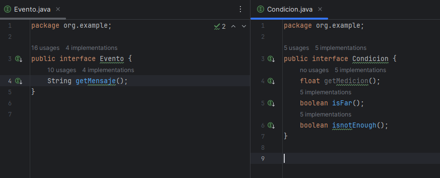

- Condiciones ambientales:
    - lluvia fuerte --> Alerta lluvia intensa
    - vientoo fuerte --> Alerta viento fuerte
    - temperatura alta y humedad alta --> Activar sistema de riego
    - Viento fuerte y temperatura alta --> Cerrar persianas
    - Presion baja --> Notificacion a usuarios sobre poca presión

## Clases

La estructura de las clases es muy similar debido a que implementamos desde la interfaz.

- Atributos: 
    -  Umbrales: existen 2 umbrales, el Alto y bajo, haciendo referencia a los puntos criticos o limite para indicar un estado de la condición del ambiente
- Metodos:
    - Existen 2 métodos importantes, isFar que indica si es una medición muy superior y isnotEnough como una medición por debajo del estandar

- Lluvia 

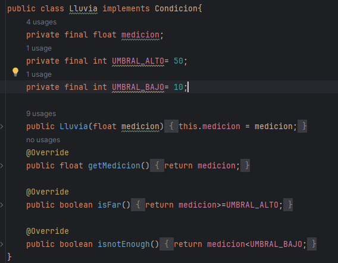

- Presion 

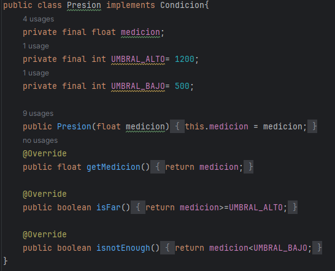

- Humedad

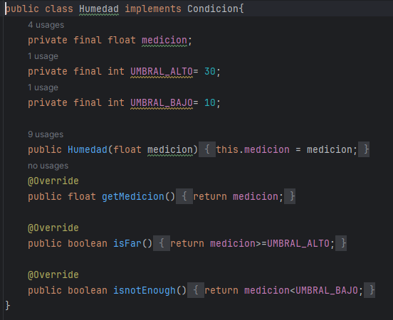

- Viento 

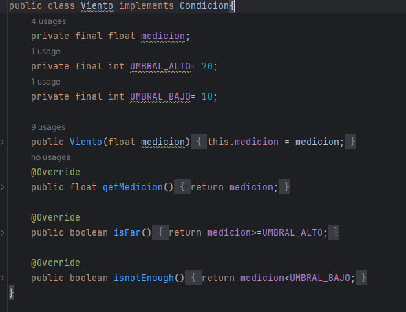

- Temperatura 

### SistemaClima
Esta es la clase principal donde todas clases se utilizan y se relacionan

- Atributos: Existen 5 atributos referido a cada medición

- Método: Existe un método DefinirEventos que según nuestras mediciones cumplan o no condiciones se agregaran eventos al sistema
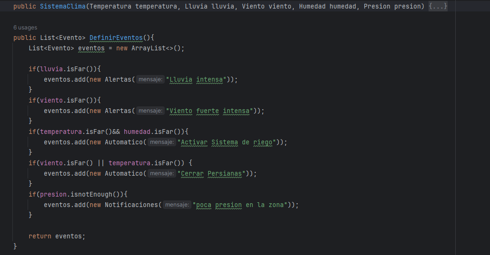
### Eventos 

En los siguientes eventos se define el estilo mensaje que se mostrará, los métodos son muy similares

- Automatico

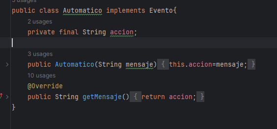

- Alertas

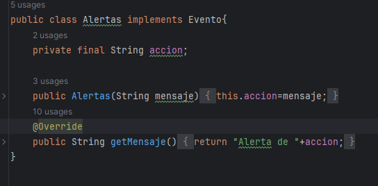

- Notificaciones

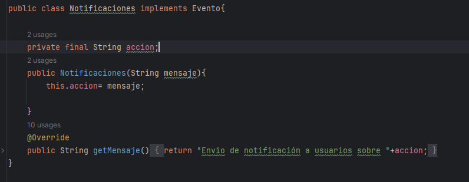
## Tests

Se crearon Tests para cada clase, de las 5 condiciones.
Estos tests son básicos y prácticamente los mismos pero evalúan los rangos en los que nuestros parámetros. Como se puede apreciar pasan todos

- Lluvia 

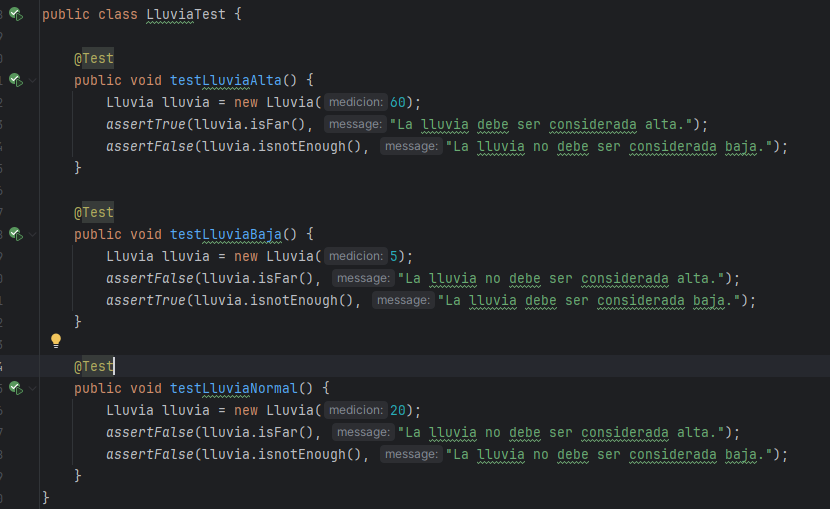

- Presion 

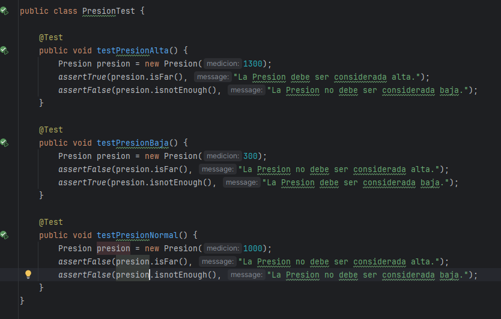

- Humedad

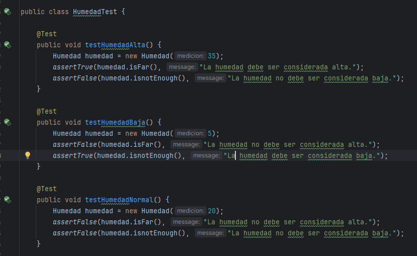

- Viento 

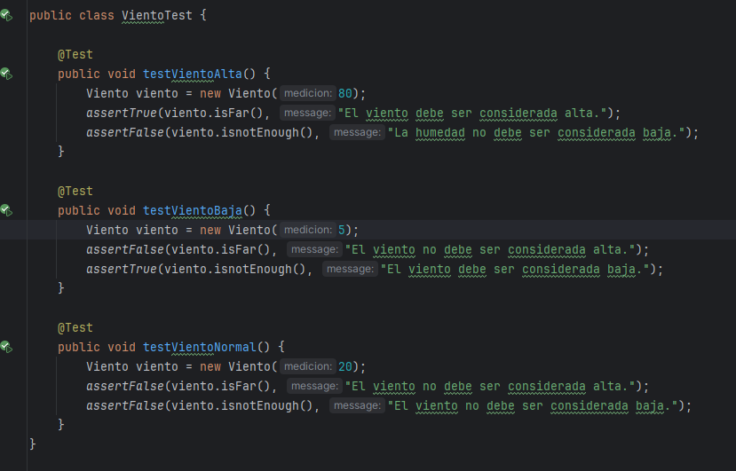

- Temperatura 

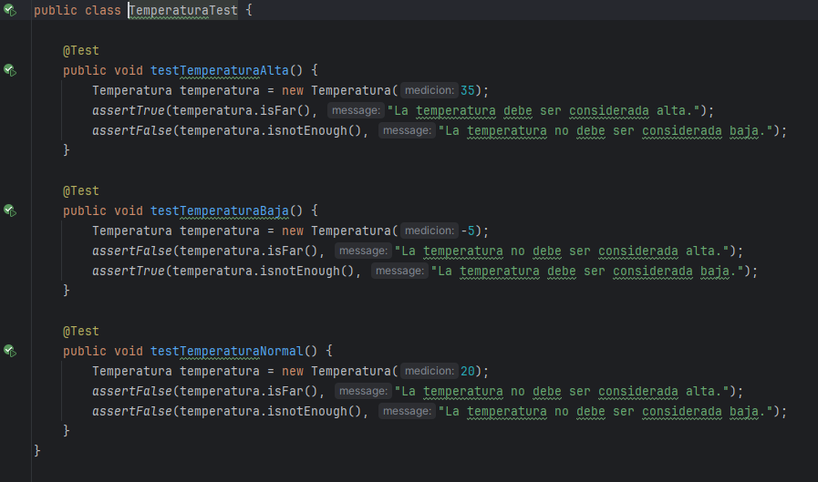

### Stubs

Usaremos stubs en la clase principal, osea el SistemaClima

Como se definieron 5 escenarios para cada evento, con la ayuda de stubs verificaremos que eso se cumpla 
- Caso lluvia intensa, Caso Viento Intenso
Usaremos nuestros parámetros para simular los escenarios reales y de ser correcto nuestra clase debería de retornarnos un Array que contenga nuestro evento en particular
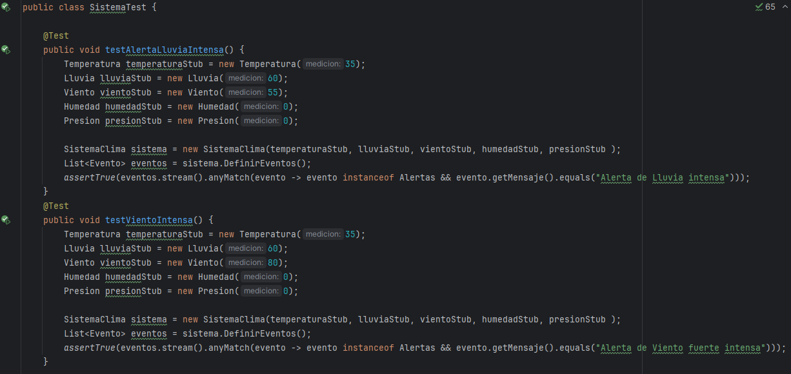

- Caso Alta Temperatura  y alta Humedad

De igual manera se testea estos escenarios
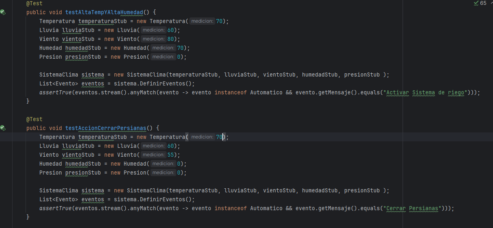

- Caso Notificación 

Finalmente testeamos el caso de la notificación
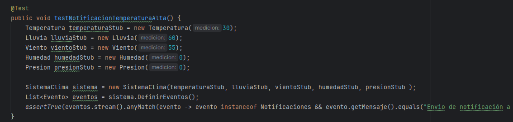

### Fakes

Se crea la clase FakeNotificaciones para simular el envio de notificaciones a usuarios

- Atributos: se tiene un mensaje y un array de usuarios
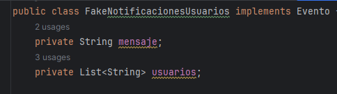

- Metodos : Se tiene getMensaje para agregar los usuarios al mensaje final
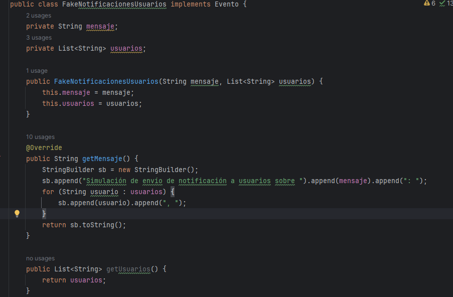

#### Test

Testeamos la correcta creación del mensaje con todos los usuarios ingresados, posteriormente verificamos con assertTrue la correcta ejecución
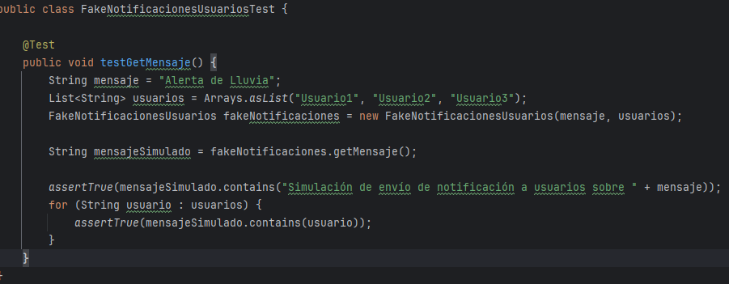

## Métricas de calidad

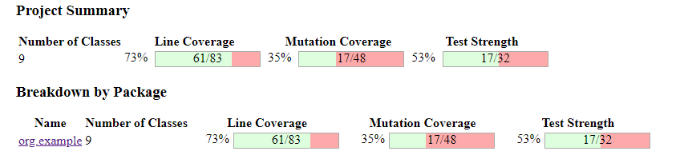

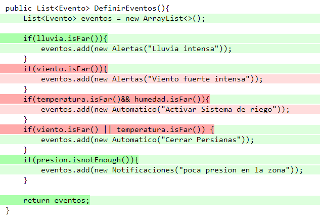

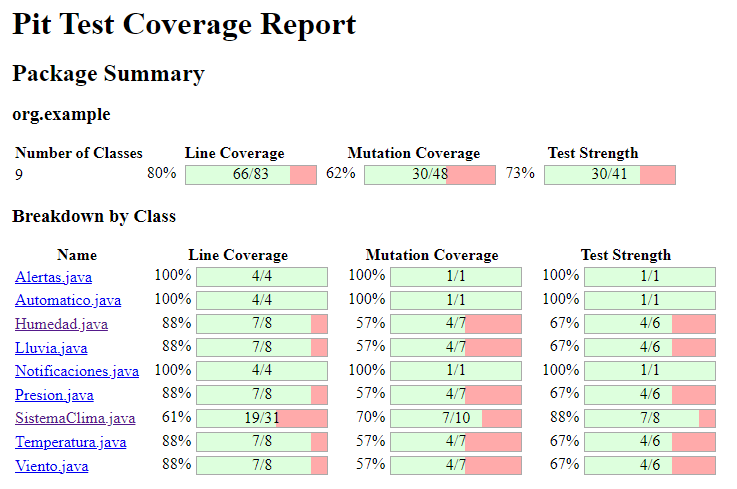